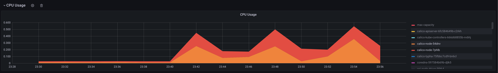
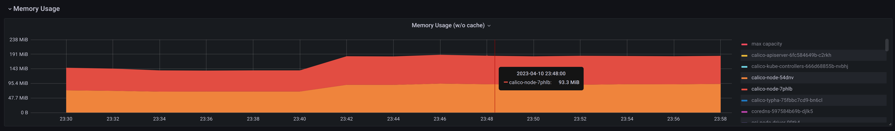
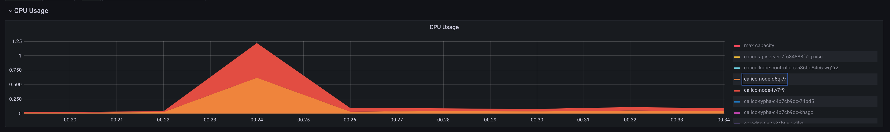
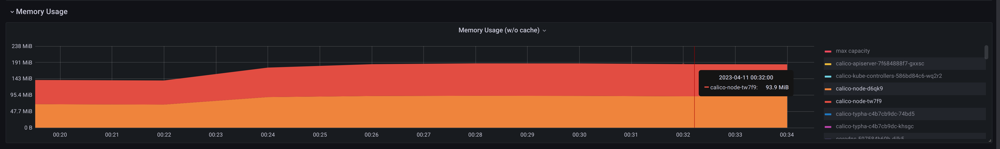
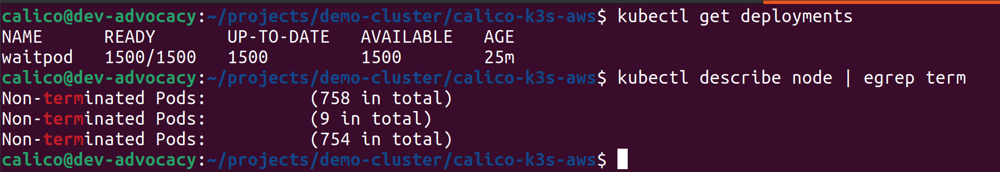
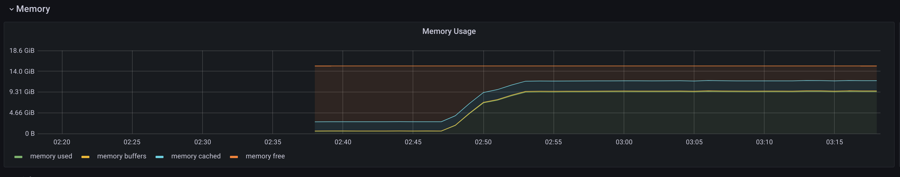
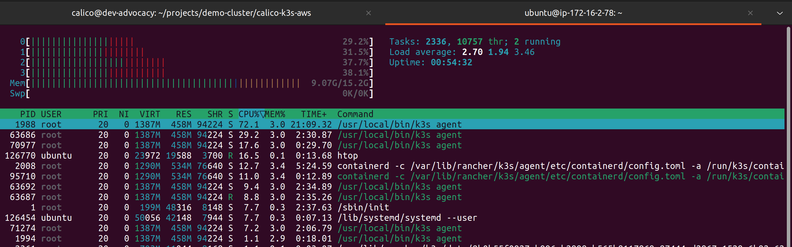

Motivations
===
After reading about the [new performance improvements](https://docs.tigera.io/calico/3.25/release-notes/#other-changes) of Calico, I wanted to verify the claims and create a reproducible way for everyone to test out these changes on their own. The purpose of this repo is to create a reasonable cluster with nodes powerful enough to run 500 pods and after reaching the initial target pushing it until it breaks. *Well this is my plan, I would love to hear about your experiments. You can share them with me via the [@fr0zenprocess](https://twitter.com/fr0zenprocess) twitter handel!*
 
Three rules for this experiment to avoid breaking the world:
1. The instance type for my experiment should not exceed the limits of my own pocket, which means something that doesn’t cost a lot of money.
1. Container networking interface parameters/configurations should not be tweaked outside their quick setup tutorials.   
1. Setup should be easy enough for anyone with any level of knowledge about Kubernetes and cloud to relate to. 

Requirements
===

An AWS account

[Terraform](https://developer.hashicorp.com/terraform/downloads?product_intent=terraform)

kubectl *

[helm](https://helm.sh/docs/intro/install/) *

Items with the `*` sign are for management.

Steps
===

Use the following command to pull the `demo-cluster` project:
```
git clone https://github.com/frozenprocess/demo-cluster
```

Browse into k3s folder:
```
cd demo-cluster/calico-k3s-aws
```

# Terraform settings

> **Note:** feel free to adjust the instance type to match your budget, but keep in mind that the charts represented here are created with these configurations.

Use the following command to create the deployment config:
```
cat > terraform.tfvars <<EOF
credential_file= "~/.aws/credentials"

region = "us-west-2"
profile= "default"
availability_zone_names = ["us-west-2a","us-west-2b","us-west-2c"]

cidr_block="172.16.0.0/16"
pod_cidr_block = "172.32.0.0/16"

image_id = "ami-0854e54abaeae283b"
cp_instance_type = "m5.2xlarge"
instance_type = "m5.xlarge"
worker_count = 2
detailed_monitoring = false
EOF
```

Use the following command to create the testing environment:
```
terraform init
```

Use the following command to prepare the installation:
```
terraform apply
```

> **Note:** After confirming the deployment, resources such as EC2 instances and public IPs will be provisioned in your account, and the cloud provider will charge you for the duration that these resources exist in your account.

At this point you will be presented with the list of resources that will be created in your AWS account, confirm the prompt if by typing `yes`.
```
Do you want to perform these actions?
  Terraform will perform the actions described above.
  Only 'yes' will be accepted to approve.

  Enter a value: 
```

After a successful deployment you will see the following message informing you about the public IP address of each instance. You can use the `calico-demo.pem` which is generated in the previous step.

If you wish to delete these tutorial resources from your AWS account follow the last section.
```
Outputs:

instance_1_private_ip = "172.16.1.246"
instance_1_public_ip = "52.43.140.93"
workers_ip = {
  "52.38.223.246" = "172.16.2.137"
  "54.188.31.25" = "172.16.2.184"
}
```

Use the instance_1_public_ip address and ssh into the control plane.
```
calico@dev-advocacy:~/projects/demo-cluster/calico-k3s-aws$ ssh -i calico-demo.pem ubuntu@52.43.140.9
```

# Calico configurations

Use the following command to install `Tigera-operator`:
```
kubectl install -f https://raw.githubusercontent.com/projectcalico/calico/v3.25.0/manifests/tigera-operator.yaml
```

Use the following example to create the installation manifest that instructs `tigera-operator` to install Calico:
```
kubectl create -f -<<EOF
apiVersion: operator.tigera.io/v1
kind: Installation
metadata:
  name: default
spec:
  calicoNetwork:
    bgp: Disabled
    ipPools:
    - blockSize: 26
      cidr: 172.32.0.0/16
      encapsulation: VXLAN
      natOutgoing: Enabled
      nodeSelector: all()
---
apiVersion: operator.tigera.io/v1
kind: APIServer 
metadata: 
  name: default 
spec: {}
EOF
```


# Prometheus and Grafana

**Note:** Make sure that you have installed helm.

Add the prometheus-community repo to your helm charts:
```
helm repo add prometheus-community https://prometheus-community.github.io/helm-charts
helm update
```

Use the following command to install Prometheus and Grafana:
```
helm install kube-prometheus-stack prometheus-community/kube-prometheus-stack  --create-namespace  --namespace calico-monitoring -f https://raw.githubusercontent.com/frozenprocess/calico-vertical-scaling-experiment/main/prometheus-custom.yaml
```

Use the following command to open the Grafana dashbaord on your local computer:
```
kubectl port-forward -n calico-monitoring   svc/kube-prometheus-stack-grafana 8080:80
```

> **Note:** The default Grafana username is admin.

Use the following command to get the password:
```
kubectl get secret --namespace calico-monitoring kube-prometheus-stack-grafana -o jsonpath='{.data.admin-password}' | base64 -d
```

## Calico Prometheus integrations

Use the following command to enable Calico Prometheus metrics:
```
kubectl patch felixconfiguration default --type merge --patch '{"spec":{"prometheusMetricsEnabled": true}}'
```

Use the following command to enable Typha Prometheus metrics:
```
kubectl patch installation default --type=merge -p '{"spec": {"typhaMetricsPort":9093}}'
```

Use the following command to create the required service for pulling Calico metrics:
```
kubectl create -f -<<EOF
apiVersion: v1
kind: Service
metadata:
  name: felix-metrics-svc
  namespace: calico-system
spec:
  clusterIP: None
  selector:
    k8s-app: calico-node
  ports:
  - port: 9091
    targetPort: 9091
---
apiVersion: v1
kind: Service
metadata:
  name: typha-metrics-svc
  namespace: calico-system
spec:
  clusterIP: None
  selector:
    k8s-app: calico-typha
  ports:
  - port: 9093
    targetPort: 9093
EOF
```

# Workload 

> **Note:** The source code for this deployment can be found [here](https://github.com/frozenprocess/calico-vertical-scaling-experiment/tree/main/wait-pod).

Use the following command to create the workload deployment:
```
kubectl create -f -<<EOF
apiVersion: apps/v1
kind: Deployment
metadata:
  labels:
    app: waitpod
  name: waitpod
spec:
  replicas: 1
  selector:
    matchLabels:
      app: waitpod
  strategy: {}
  template:
    metadata:
      labels:
        app: waitpod
    spec:
      affinity:
        nodeAffinity:
          requiredDuringSchedulingIgnoredDuringExecution:
            nodeSelectorTerms:
            - matchExpressions:
              - key: node-role.kubernetes.io/master
                operator: DoesNotExist
              - key: node-role.kubernetes.io/control-plane
                operator: DoesNotExist
      containers:
      - image: rezareza/wait-pod:latest
        name: wait-pod
EOF
```

> **Note:** Click [here](https://docs.tigera.io/calico/latest/operations/monitor/) to learn more about Calico monitoring.

# Scaling Kubernetes style

Use the following command to scale the workloads to 1000 pods:
```
kubectl patch deployment waitpod --type=json -p='[{"op":"replace", "path": "/spec/replicas", "value" : 1000   }]'
```

> **Fun fact:** While peaks and valleys are a good exercise for humans, their usually indication of inefficiency in computer programs.

Wait for the deployment to finish and check your Grafana dashboard you should see a result similar to the following images:







Use the following command to scale down the workloads:
```
kubectl patch deployment waitpod --type=json -p='[{"op":"replace", "path": "/spec/replicas", "value" : 1   }]'
```

Wait for the scale down to finish.

# Upgrading Calico to v3.25.1

Use the following command to upgrade Calico:
```
kubectl replace -f https://raw.githubusercontent.com/projectcalico/calico/v3.25.1/manifests/tigera-operator.yaml
```

Use the following command to scale the workloads:
```
kubectl patch deployment waitpod --type=json -p='[{"op":"replace", "path": "/spec/replicas", "value" : 1000   }]'
```

Wait for the deployment to finish and check your Grafana dashboard you should see a result similar to the following images:



Let's scale further
Use the following command to scale the workloads:
```
kubectl patch deployment waitpod --type=json -p='[{"op":"replace", "path": "/spec/replicas", "value" : 1500   }]'
```

Wait for the deployment to finish and check your Grafana dashboard you should see a result similar to the following images:




Use the following command to scale 1000 workloads on each worker node:
```
kubectl patch deployment waitpod --type=json -p='[{"op":"replace", "path": "/spec/replicas", "value" : 2000   }]'
```

Wait for the deployment to finish and check your Grafana dashboard you should see a result similar to the following images:


**Just to clarify**, the failure that occurred had nothing to do with k3s, Kubernetes, or Calico scaling capabilities and it could’ve been prevented by following the high availability design and preparing the host OS for this number of workloads.

# Clean up
It is vital to clean up the resource that you created in your AWS account by following this tutorial. Please keep in mind that cloud providers charge on demand so the longer you leave these instances on the more that you have to pay your provider.

Use the following command inside the calico-k3s-aws folder to destroy all the resources that was created for this testing environment:
```
terraform destroy
```
